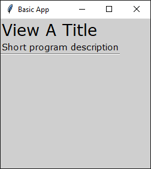
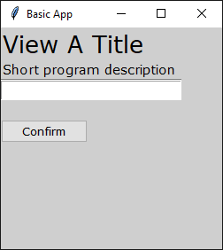
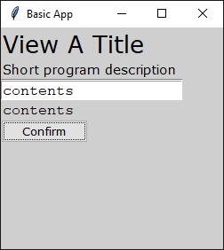

# Package Guide
TkiWrapper package guide.

This document describes how to start project that utilizes this package.
Knowledge of Python 3 is assumed.

Last updated for package version `0.4`

Attached screenshots were made on Windows 10.


## Creating Hello World App

#### Creating app core
In this section I will show you how to create the most basic app with my package.

In this guide I assume package was imported with the following call
```python
import TkiWrapper as tkw
```

To start an App a few objects will be required. The first one is a `root`.
`Root` class manages window properties and widget data
but this will be explained later.

Also note that later a `root` object will have to be accessible from various
event based functions. To do that you have to wrap your whole app
in a class or make `root` a global variable.
In this guide I try not to keep things simple so I will implement latter solution.

Additionally everything will be split into functions so when I change
pieces of code later in guide I don't have to paste the whole thing here over and over.

Defining `createRoot` function
```python
def createRoot():
    global root                 # Making root a global variable
    root = tkw.Root()           # Creating root instance
    root.setTitle('Basic App')  # Setting window title
    root.setMinSize(250, 250)   # Setting minimum window size to w=250px, h=250px
```

At this point the app should be an empty window.
To test how it looks just call function in standard pythonic "if main".

To actually see the window and be able to interact with it a run loop is required.
Run loop is a loop that breaks when user leaves the app and updates `ROOT` object
in each increment.

You can put additional code in the loop if you want something to be
done when the app is running.

Adding `createRoot` call and creating run loop.
```python
if __name__ == '__main__':
    createRoot()                # Creating and configuring root
    while not root.leave:       # Creating a run loop (note that root is a global)
        # put additional code here
        root.update()
```

When this code is executed something like this should appear.  


#### Introducing styles
Another element of the package required to run the app is a `style` object.
`Style` class manages app and widgets appearance.

Note that with out this it is impossible to add some types with out any styles
so please do not skip this part.

Creating `STYLE` instance and applying default styles to `ROOT`
```python
def createStyle():
    style = tkw.Style()         # Create style instance
    style.useTheme('vista')     # Use tkinter's vista as default theme
    style.apply(root)           # Apply styles to root
```

Adding `createStyle` call in "if main"
```python
if __name__ == '__main__':
    createRoot()
    createStyle()               # Creating and configuring styles
    while not root.leave:
        root.update()
```

This code should produce the following window.  


As you can see not much changes. In our `createStyle` function we only
initialized `Style` object and set default theme
but styling options will be described later in guide when widgets are present.


#### Introducing views
`View` class objects can actually be displayed on screen.
When widgets are created, they are added to `view` objects.

The `root` window has 3 slots for views: `Header`, `Main View` and `Footer`.
You can add views to these slots.

Let's define function that creates a basic empty view.

```python
def createView1():
    view = tkw.View(root)       # Create view object
    root.addView(view, 'view_1st') # Add view to root under "view_1st" key.
```

The `root`'s method `addView` we just called adds view to `Main view` slot.
Well, not actually adds. `Root` class has a dictionary of views and what actually
happened was out view was added to this dictionary.
That's why this method requires a key parameter to add views.

To show our view on screen we have to call `root.switchToView` method.
This method hides all views that were added to `Main View` slot and shows
only view with key that we passed.

Adding `switchToView` call.
```python
if __name__ == '__main__':
    createRoot()
    createStyle()
    createView1()               # Create and fill view "view_1st"
    root.switchToView('view_1st') # Switch to view added with key "view_1st"
    while not root.leave:
        root.update()
```

Since our view is empty this code produces the same result as previous one.
This will change in next section.


#### Adding static widgets
This section describes how to add static widgets to views.

To add a widget just call view's method with `add` prefixes.

Adding header, text and separator widgets.
```python
def createView1():
    view = tkw.View(root)
    root.addView(view, 'view_1st')

    view.addHeading('View A Title', 2) # Create lv. 2 heading
    view.addText('Short program description') # Create static text
    view.addSeparator()
```

Execute the script and a window that looks like this should appear.  


For widget costumization and detailed settings check the reference.


#### Adding interactive widgets
This section describes how to add input and output widgets to views.

Interactive widgets require The key to be added.
A key must be variable that can be used as key of dictionary.
Note that key of a widget must be unique within widget type.

Adding text input, text output and a button.
```python
def createView1():
    view = tkw.View(root)
    root.addView(view, 'view_1st')

    view.addHeading('View A Title', 2)
    view.addText('Short program description')
    view.addSeparator()
    view.addInputText('1-1') # Adding input text field with key "1-1"
    view.addOutputText('1-1') # Adding output text field with key "1-1"
    view.addButton('1-1', 'Confirm', confirm)
    # Adding button with key "1-1", label "Confirm"
    # When button is pressed function confirm() will be called
```

Reading contents of input widgets and changing contents of outputs is made through
`root`'s methods. In the code above you can see a button received a `onclick` function
that will be called when it's pressed. Let's define this function now.

This function will read contents of text input `'1-1'` and paste it to output `'1-1'`.
Note that there is no key conflict because those widgets are of different types.
If they were of the same type there would be a conflict and things would not work
as expected.

Defining `onclick` function of button `'1-1'`
```python
def confirm():
    text = root.readInputText('1-1')
    root.setOutputText('1-1', text)
```

This code should produce window that looks like this one.  




## Customization

#### Positioners
This section describes positioner objects.
Positioner manages position and span of all widgets.

`Grid` has a pointer that selects grid cell in which widget will be placed.
The pointer automatically changes position every time a widget is added.
This means that in simplest apps you don't have to
do anything but initialize the object.

`Grid` has methods which modify behaviour of pointer auto-increment
and position of pointer itself but they will not be used in this section.

By default each view has a `grid` object assigned as its positioner.
You can change that by passing other object in `view`'s constructor
or using `View.setPositioner` method. Note that package does not include
other types of positioners and to do that you would have to write one yourself.
